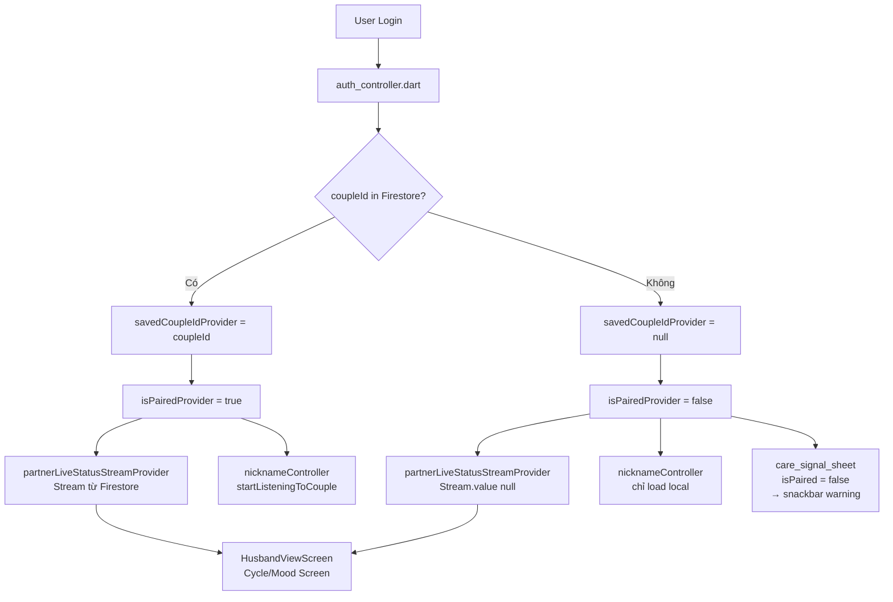
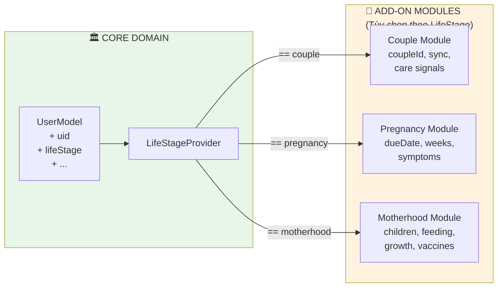
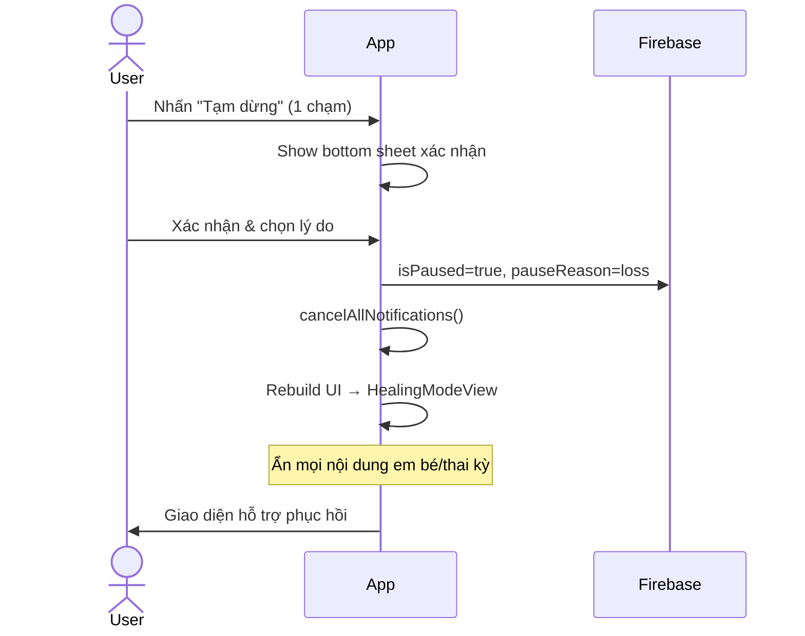
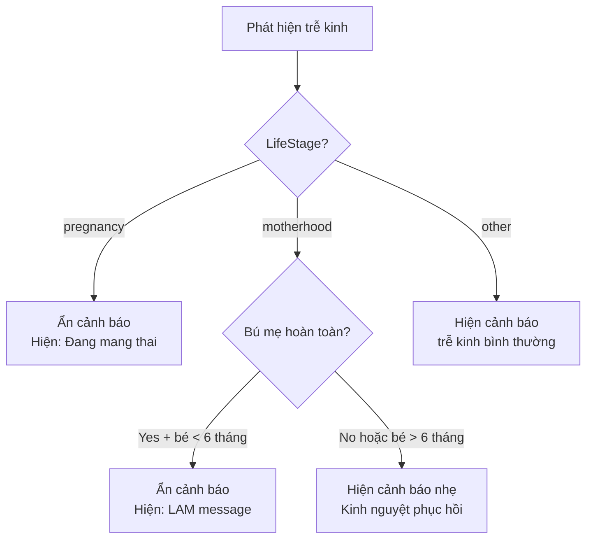
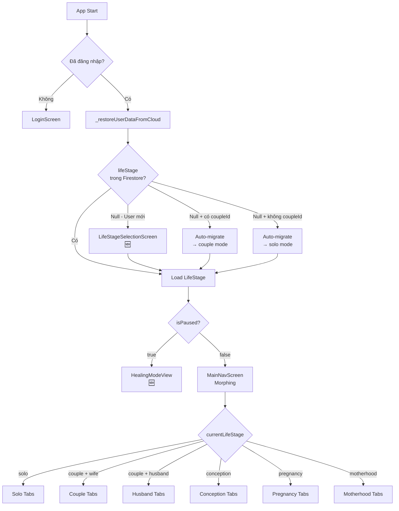
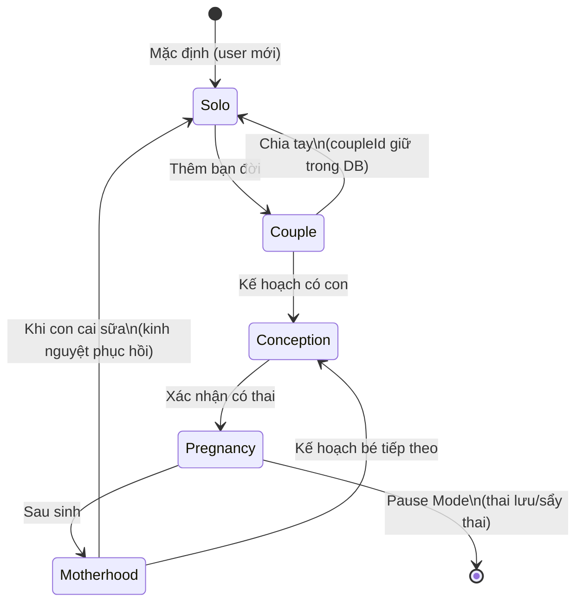
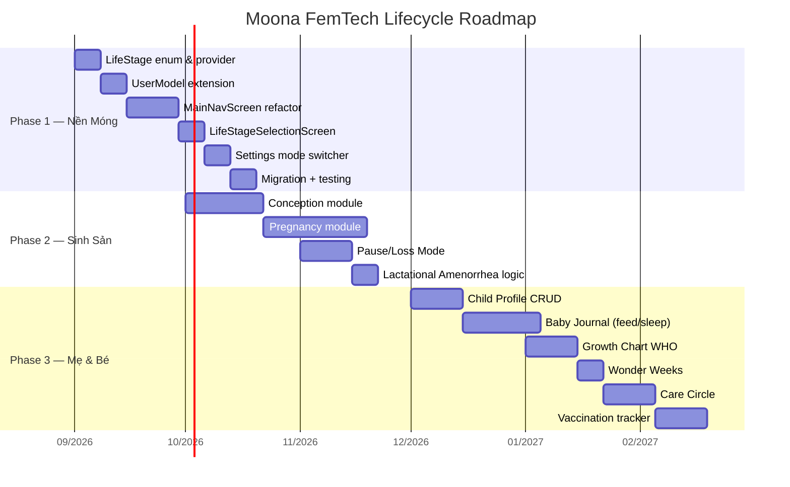
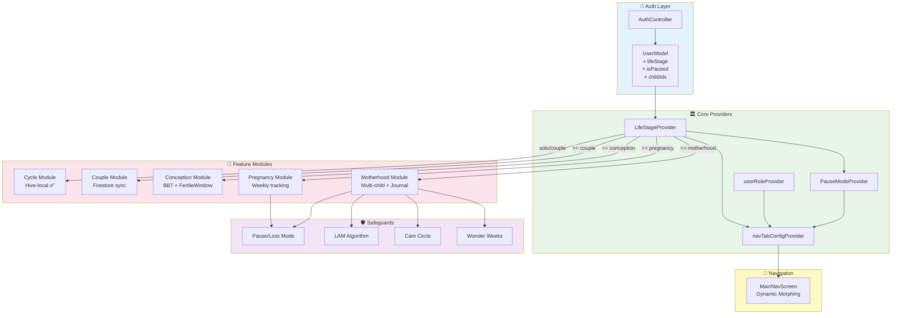

# FEMTECH LIFECYCLE ARCHITECTURE PLAN
**Đề Án Kỹ Thuật Toàn Diện: Chuyển Đổi Moona Thành Nền Tảng Chăm Sóc Sức Khỏe Vòng Đời Phụ Nữ**

> **Trạng thái:** 📋 DRAFT — Chờ phê duyệt triển khai  
> **Ngày tạo:** 2026-09-04  
> **Phiên bản codebase khảo sát:** v0.6.7+22  
> **Phiên bản mục tiêu:** v1.0.0 (All-in-One Female Lifecycle Platform)

---

## TỔNG QUAN SẢN PHẨM

```
MOONA v0.6.7 (Hiện tại)        →    MOONA v1.0.0 (Mục tiêu)
────────────────────────             ──────────────────────────────────
Ứng dụng chu kỳ cặp đôi 1-1        Nền tảng FemTech vòng đời phụ nữ
  - Theo dõi kinh nguyệt                - 5 chế độ sống động
  - Sync realtime vợ-chồng              - Cá nhân hoá theo giai đoạn
  - Care Signals 1-1                    - Vòng tròn chăm sóc linh hoạt
  - UserRole: wife/husband              - LifeStage: 5 modes
```

**5 Life Stages:**

| # | Mode | Icon | Đối tượng |
|---|------|------|-----------|
| 1 | **NÀNG** (Solo) | 🌸 | Phụ nữ độc thân, thiếu niên theo dõi chu kỳ cơ bản |
| 2 | **CHUNG ĐÔI** (Couple) | 💑 | Cặp đôi — tính năng hiện tại giữ nguyên |
| 3 | **CHUẨN BỊ BẦU** (Conception) | 🌱 | Kế hoạch thụ thai, BBT, cửa sổ thụ thai nâng cao |
| 4 | **THAI KỲ** (Pregnancy) | 🤰 | Theo dõi thai nhi tuần 1–40, lịch khám, triệu chứng |
| 5 | **NUÔI CON** (Motherhood) | 🍼 | Hồ sơ nhiều bé, nhật ký sơ sinh, biểu đồ WHO |

---

## BÀI TOÁN 1: TÁCH RỜI LOGIC GHÉP ĐÔI CỨNG (DECOUPLING AUDIT)

### 1.1. Sơ đồ phụ thuộc hiện tại



### 1.2. Bản đồ phụ thuộc chi tiết

#### 🔴 CRITICAL — Ảnh hưởng trực tiếp luồng chính

| File | Điểm phụ thuộc | Hành vi khi `coupleId = null` | Rủi ro |
|------|---------------|-------------------------------|--------|
| `auth_controller.dart:68–74` | Restore `coupleId` từ Firestore khi login | Gán `null` → OK ✅ | Thấp |
| `partner_sync_controller.dart:19–28` | `savedCoupleIdProvider`, `isPairedProvider` | `null`, `false` → OK ✅ | Thấp |
| `partner_sync_controller.dart:45–52` | `partnerLiveStatusStreamProvider` | Guard: `Stream.value(null)` ✅ | Thấp |
| `nickname_controller.dart:77–80` | Auto-listen `couples/{coupleId}` | Check `isEmpty` → skip ✅ | Thấp |
| `partner_sync_repository.dart` | CRUD trên `couples/{coupleId}` | Không được gọi khi `null` ✅ | Thấp |

#### 🟡 WARNING — UI bị ảnh hưởng (không crash, nhưng UX sai)

| File | Điểm phụ thuộc | Hành vi Solo | Giải pháp cần làm |
|------|---------------|-------------|-------------------|
| `cycle_screen.dart:73–110` | `isPaired` điều khiển nút sync và màu sắc | Nút sync mờ/ẩn | Thay bằng `isCoupleMode` |
| `mood_screen.dart:63–133` | `isPaired` hiện banner trạng thái chồng | Banner ẩn | Thay bằng `isCoupleMode` |
| `care_signal_sheet.dart:53–180` | `isPairedProvider` trước khi gửi tín hiệu | Snackbar "chưa kết nối" | Thay bằng `isCoupleMode` |
| `settings_screen.dart:72–73` | `isConnected = coupleId != null` | Section ghép đôi ẩn | Đọc từ `lifeStageProvider` |
| `care_signal_model.dart:49` | `coupleId` là required field | Gửi tín hiệu không thành công | Thêm guard check |

#### 🟢 SAFE — Hoàn toàn độc lập

| Module | Lý do an toàn |
|--------|--------------|
| `cycle_controller.dart` + toàn bộ Cycle domain | 100% Hive local, zero Firestore dependency |
| `mood_controller.dart` | 100% Hive local |
| `nutrition` module | 100% local data |
| `auth` module | Không bắt buộc coupleId để login/logout |

### 1.3. Kiến trúc mới — User là thực thể tối cao



**Nguyên tắc thiết kế mới:**
1. `User` entity tồn tại và hoạt động hoàn toàn độc lập, không phụ thuộc bất kỳ Add-on nào
2. `CoupleModule` chỉ được load khi `LifeStage == couple`
3. `isPairedProvider` → deprecated, thay bằng `isCoupleMode`
4. `UserRole.husband` chỉ khả dụng khi `LifeStage == couple`

---

## BÀI TOÁN 2: MÔ HÌNH DỮ LIỆU ĐA TẦNG (5 LIFE STAGES DATA MODELS)

### 2.1. Enum `LifeStage`

```dart
// lib/core/constants/life_stage.dart [FILE MỚI]

/// Giai đoạn sống hiện tại của người dùng.
/// Điều khiển toàn bộ layout, tính năng và điều hướng của ứng dụng.
enum LifeStage {
  solo,        // 🌸 Độc thân / Thiếu niên
  couple,      // 💑 Có đôi / Vợ chồng
  conception,  // 🥚 Kế hoạch có con
  pregnancy,   // 🤰 Đang mang thai
  motherhood,  // 🍼 Đang nuôi con
}

extension LifeStageExt on LifeStage {
  String get displayName => switch (this) {
    LifeStage.solo        => 'Nàng (Solo)',
    LifeStage.couple      => 'Chung Đôi',
    LifeStage.conception  => 'Đón Bé',
    LifeStage.pregnancy   => 'Thai Kỳ',
    LifeStage.motherhood  => 'Nuôi Con',
  };

  String get emoji => switch (this) {
    LifeStage.solo        => '🌸',
    LifeStage.couple      => '💑',
    LifeStage.conception  => '🥚',
    LifeStage.pregnancy   => '🤰',
    LifeStage.motherhood  => '🍼',
  };

  /// Kiểm tra module được kích hoạt
  bool get requiresCoupleModule => this == LifeStage.couple;
  bool get requiresConceptionModule => this == LifeStage.conception;
  bool get requiresPregnancyModule  => this == LifeStage.pregnancy;
  bool get requiresMotherhoodModule => this == LifeStage.motherhood;

  /// Có theo dõi chu kỳ kinh nguyệt không?
  bool get tracksMenstrualCycle =>
    this == LifeStage.solo ||
    this == LifeStage.couple ||
    this == LifeStage.conception;

  /// Chu kỳ có bị tạm ẩn do đang mang thai hoặc cho con bú không?
  bool get cycleTrackingPaused =>
    this == LifeStage.pregnancy ||
    this == LifeStage.motherhood;
}
```

### 2.2. Mở rộng `UserModel`

```dart
// lib/features/auth/domain/models/user_model.dart [SỬA ĐỔI]

class UserModel {
  final String uid;
  final String displayName;
  final String email;
  final String? photoUrl;
  final String? role;                // Giữ nguyên backward compat: 'wife'|'husband'
  final DateTime? createdAt;
  final DateTime? lastLoginAt;

  // ─── FIELDS MỚI ───────────────────────────────────────
  final String? lifeStage;           // 'solo'|'couple'|'conception'|'pregnancy'|'motherhood'
  final String? pregnancyDueDate;    // ISO8601 — ngày dự sinh
  final DateTime? conceptionStartDate; // Ngày bắt đầu kế hoạch thụ thai
  final List<String> childIds;       // Danh sách ID hồ sơ con
  final bool isPaused;               // Cờ chế độ tạm dừng/chữa lành
  final String? pauseReason;         // 'loss' | 'medical' | 'personal'
  // ──────────────────────────────────────────────────────

  LifeStage get currentLifeStage => LifeStage.values.firstWhere(
    (s) => s.name == lifeStage,
    orElse: () {
      // Backward compat: user cũ có role nhưng chưa có lifeStage
      if (role == 'husband') return LifeStage.couple;
      return LifeStage.solo;
    },
  );
}
```

### 2.3. Data Models theo từng Life Stage

#### Stage 1: Solo 🌸
```dart
// Không cần entity mới — CycleInfo + MoodEntry đã đủ
// Chỉ cần đảm bảo chúng hoạt động khi isPaired = false

// Thêm mới: Cẩm nang riêng tư (Privacy Guide)
// lib/features/solo/domain/models/health_guide_model.dart
class HealthGuideModel {
  final String id;
  final String category;  // 'puberty' | 'adult' | 'pms' | 'nutrition'
  final String title;
  final String content;
  final String? imageUrl;
}
```

#### Stage 3: Conception 🥚
```dart
// lib/features/conception/domain/models/bbt_log_model.dart [MỚI]
class BbtLogModel {
  final String id;
  final String uid;
  final DateTime date;
  final double temperatureCelsius; // Nhiệt độ buổi sáng khi thức dậy
  final String? notes;
  final bool isConfirmed; // Đã được xác nhận (không sốt, ngủ đủ giấc)
}

// lib/features/conception/domain/models/intimacy_log_model.dart [MỚI]
class IntimacyLogModel {
  final String id;
  final String uid;
  final DateTime date;
  final bool isProtected;
  final String? notes;
}
```

#### Stage 4: Pregnancy 🤰
```dart
// lib/features/pregnancy/domain/models/pregnancy_config_model.dart [MỚI]
class PregnancyConfigModel {
  final DateTime dueDate;          // Ngày dự sinh
  final DateTime? conceptionDate;  // Ngày thụ thai (nếu biết)

  int get currentWeek {
    final today = DateTime.now();
    final start = conceptionDate ?? dueDate.subtract(const Duration(days: 280));
    return today.difference(start).inDays ~/ 7;
  }
}

// lib/features/pregnancy/domain/models/pregnancy_week_entry.dart [MỚI]
class PregnancyWeekEntry {
  final int weekNumber;    // Tuần thai 1–40
  final DateTime date;
  final double? weightKg;  // Cân nặng mẹ
  final String? symptoms;  // "Ốm nghén, mệt mỏi"
  final String? notes;
  final double? bloodPressureSystolic;
  final double? bloodPressureDiastolic;
  final bool kickCounted; // Đã đếm cử động thai nhi chưa
}

// lib/features/pregnancy/domain/entities/fetal_size_data.dart [MỚI]
// Dữ liệu tĩnh: kích thước và cân nặng thai nhi mỗi tuần theo chuẩn WHO
class FetalSizeData {
  final int week;
  final String fruitComparison;  // "Quả chanh 🍋"
  final double lengthCm;
  final double weightGrams;
  final String milestone;        // "Tim thai bắt đầu đập"

  static const List<FetalSizeData> weeklyData = [
    // Week 4 → Week 40
    // Dữ liệu embed sẵn trong app
  ];
}

// lib/features/pregnancy/domain/models/prenatal_appointment.dart [MỚI]
class PrenatalAppointment {
  final String id;
  final DateTime scheduledDate;
  final String doctorName;
  final String location;
  final String type; // 'ultrasound' | 'checkup' | 'bloodtest' | 'vaccine'
  final bool isCompleted;
  final String? notes;
}
```

#### Stage 5: Motherhood 🍼
```dart
// lib/features/motherhood/domain/models/child_profile_model.dart [MỚI]
class ChildProfileModel {
  final String childId;              // UUID
  final String parentUid;           // UID của mẹ
  final String name;                // Tên bé
  final DateTime birthDate;         // Ngày sinh
  final String gender;              // 'girl' | 'boy' | 'unspecified'
  final String? avatarUrl;
  final List<String> caregiverUids; // Co-caregivers (bố, bà...)
  final bool isBreastfeeding;       // Có đang bú mẹ hoàn toàn không?
  final bool isPaused;              // Tạm dừng tracking
}

class FeedingLogModel {
  final String id;
  final String childId;
  final DateTime startTime;
  final DateTime? endTime;
  final String type; // 'breastLeft'|'breastRight'|'bottle'|'solid'
  final int? amountMl;
  final String? notes;
}

class SleepLogModel {
  final String id;
  final String childId;
  final DateTime sleepTime;
  final DateTime? wakeTime;
  final String quality; // 'good'|'ok'|'poor'
  final String? notes;
}

class GrowthLogModel {
  final String id;
  final String childId;
  final DateTime date;
  final double? weightKg;
  final double? heightCm;
  final double? headCircumferenceCm;
  // WHO Percentile được tính toán client-side
}

class VaccinationModel {
  final String id;
  final String childId;
  final String vaccineName;
  final DateTime scheduledDate;
  final DateTime? completedDate;
  final String? batchNumber;
  final String? sideEffects;
}

// Wonder Weeks mốc phát triển tri giác
class WonderWeeksModel {
  final int babyAgeWeeks;    // Tuổi bé tính bằng tuần
  final String leapName;     // "Nhận thức về vật thể"
  final String description;  // Mô tả hành vi bé sẽ thay đổi
  final String parentTip;    // Lời khuyên cho bố/mẹ
  final bool isStormPeriod;  // Giai đoạn bé quấy khóc
}
```

### 2.4. Firestore Schema đầy đủ

```
🗄️ FIRESTORE STRUCTURE

users/{uid}/                          ← UserModel (mở rộng)
  ├── uid, email, displayName
  ├── role: 'wife'|'husband'          ← Giữ backward compat
  ├── lifeStage: 'solo'|...           ← [MỚI]
  ├── coupleId?: string               ← Giữ nguyên
  ├── pregnancyDueDate?: string       ← [MỚI]
  ├── childIds?: string[]             ← [MỚI]
  ├── isPaused?: bool                 ← [MỚI] Pause/Loss Mode
  ├── pauseReason?: string            ← [MỚI]
  ├── nicknames?: {...}               ← Giữ nguyên
  └── updatedAt: timestamp

  ├── pregnancyJournal/{weekEntry}/   ← [MỚI - Phase 2]
  │     ├── weekNumber, date
  │     ├── weightKg, bloodPressure
  │     ├── symptoms, notes
  │     └── kickCounted

  ├── prenatalAppointments/{id}/      ← [MỚI - Phase 2]
  │     └── PrenatalAppointment fields

  └── children/{childId}/             ← [MỚI - Phase 3]
        ├── ChildProfileModel fields
        ├── feedingLogs/{id}/
        ├── sleepLogs/{id}/
        ├── growthLogs/{id}/
        └── vaccinations/{id}/

couples/{coupleId}/                    ← KHÔNG THAY ĐỔI
  ├── PairingModel fields
  ├── partnerStatus/today/
  └── careSignals/{id}/

conceptionLogs/{uid}/                  ← [MỚI - Phase 2, lưu riêng vì nhạy cảm]
  ├── bbtLogs/{id}/
  └── intimacyLogs/{id}/
```

---

## BÀI TOÁN 3: 4 TÍNH NĂNG BẢO VỆ TÂM LÝ & SINH HỌC ĐẶC THÙ

### 3.1. Chế Độ Tạm Dừng & Chữa Lành (Pause & Loss Mode)

**Kịch bản:** Người dùng vừa trải qua thai lưu, sẩy thai, hoặc mất mát cá nhân.

```dart
// lib/core/providers/pause_mode_provider.dart [MỚI]

class PauseModeNotifier extends StateNotifier<PauseModeState> {
  PauseModeNotifier(...) : super(PauseModeState.normal());

  /// Kích hoạt chế độ tạm dừng 1 chạm
  Future<void> activatePauseMode({required String reason}) async {
    state = PauseModeState(
      isActive: true,
      reason: reason,         // 'loss' | 'medical' | 'personal'
      activatedAt: DateTime.now(),
    );

    // 1. Ghi lên Firestore (isPaused: true)
    // 2. Hủy TẤT CẢ notification liên quan đến thai kỳ/tuần thai
    // 3. Ẩn các widget em bé trong Motherhood mode
    // 4. Chuyển UI sang màn hình hỗ trợ phục hồi
    await _cancelAllBabyNotifications();
    await _syncPauseStateToFirestore(reason);
  }

  /// Tắt chế độ tạm dừng khi người dùng sẵn sàng
  Future<void> deactivatePauseMode() async { ... }
}

class PauseModeState {
  final bool isActive;
  final String? reason;
  final DateTime? activatedAt;
  final String? recoveryNote; // Ghi chú cá nhân của người dùng
}
```

**Hành vi UI khi Pause Mode = true:**

| Widget bị ẩn | Thay thế bằng |
|-------------|---------------|
| Countdown "X tuần thai" | Card hỗ trợ sức khỏe tinh thần |
| Baby log tracker | Nút "Tôi cần thời gian" |
| Growth chart | Đường dây hỗ trợ tâm lý |
| Notification thai nhi | TẮT hoàn toàn |



### 3.2. Thuật Toán Vô Kinh Do Nuôi Con (Lactational Amenorrhea — LAM)

**Vấn đề:** Phụ nữ cho con bú hoàn toàn thường không có kinh 6–12 tháng sau sinh. Nếu app tiếp tục cảnh báo "Trễ kinh X ngày" sẽ gây lo lắng không cần thiết.

```dart
// lib/features/cycle/domain/usecases/cycle_alert_filter.dart [MỚI]

class CycleAlertFilter {
  static bool shouldShowLatePeriodWarning({
    required LifeStage currentLifeStage,
    required bool isBreastfeedingExclusively,
    required DateTime? birthDate,
    required int daysLate,
  }) {
    // Điều kiện LAM: Nuôi con + đang bú hoàn toàn + bé < 6 tháng
    if (currentLifeStage == LifeStage.motherhood) {
      if (isBreastfeedingExclusively && birthDate != null) {
        final babyAgeMonths = DateTime.now().difference(birthDate).inDays / 30;
        if (babyAgeMonths < 6) {
          return false; // ← KHÔNG cảnh báo trễ kinh
        }
      }
    }

    // Cũng không cảnh báo khi đang mang thai
    if (currentLifeStage == LifeStage.pregnancy) return false;

    return daysLate > 0;
  }

  static String getLamStatusMessage({
    required bool isBreastfeedingExclusively,
    required DateTime birthDate,
  }) {
    final weeks = DateTime.now().difference(birthDate).inDays ~/ 7;
    if (isBreastfeedingExclusively && weeks < 26) {
      return '🤱 Đang trong giai đoạn vô kinh sinh lý (LAM). '
             'Chu kỳ sẽ trở lại khi giảm cữ bú hoặc bé > 6 tháng.';
    }
    return 'Kinh nguyệt dần phục hồi. Hãy ghi nhật ký khi có kinh trở lại.';
  }
}
```

**Luồng quyết định:**


### 3.3. Vòng Tròn Chăm Sóc — Care Circle (Thay thế liên kết 1-1)

**Vấn đề:** `CareSignalModel` hiện tại cứng nhắc `coupleId: String (required)`. Mẹ đơn thân không thể dùng; bố/bà không có quyền ghi log cho bé.

**Thiết kế mới:**

```dart
// lib/core/domain/models/care_circle_member.dart [MỚI]

enum CareCircleRole {
  primary,    // Mẹ/người chăm sóc chính — quyền cao nhất
  partner,    // Bố/chồng — quyền ngang (nếu Couple mode)
  caregiver,  // Bà nội/bà ngoại — chỉ xem + ghi log
  viewer,     // Chỉ xem (cho phép bạn bè support)
}

class CareCircleMember {
  final String uid;
  final String displayName;
  final String? photoUrl;
  final CareCircleRole role;
  final DateTime joinedAt;
  final List<String> permissions; // 'read' | 'write_log' | 'admin'
}

// Firestore path: careCircles/{circleId}/members/{uid}
// Linked from: users/{uid}/careCircleId

class CareCircleModel {
  final String circleId;
  final String primaryUid;      // Mẹ/người chăm sóc chính
  final List<CareCircleMember> members;
  final String? coupleId;       // Nếu có ghép đôi truyền thống
  final bool allowCareSignals;  // Có bật Care Signals không?
}
```

**So sánh cũ/mới:**
```
TRƯỚC: couples/{coupleId} — 1 vợ 1 chồng cứng nhắc
  CareSignalModel.coupleId (required) → crash khi solo

SAU: careCircles/{circleId} — linh hoạt theo nhu cầu
  Mẹ đơn thân: circle với 1 member (primary)
  Mẹ + Bố:     circle với 2 members (primary + partner)
  Mẹ + Bà:     circle với 2+ members (primary + caregiver)
  Backward compat: couple cũ → circle tự động với coupleId reference
```

### 3.4. Dự Báo Tuần Khủng Hoảng — Wonder Weeks

**Cơ sở khoa học:** Theo nghiên cứu Heldermeijer & Rijkheid (1992), trẻ sơ sinh trải qua các "leaps" (bước nhảy vọt tri giác) tại các tuần: **5, 8, 12, 15, 19, 23, 26, 29, 34, 40** (tính từ ngày dự sinh).

```dart
// lib/features/motherhood/domain/entities/wonder_weeks_data.dart [MỚI]

class WonderWeek {
  final int leapNumber;
  final int startWeek;     // Tuần tuổi (tính từ ngày dự sinh)
  final int endWeek;
  final String leapName;   // VD: "Nhận thức về Cảm giác"
  final String stormPeriodDescription;
  final String newSkills;  // Kỹ năng bé sẽ đạt được
  final String parentTip;

  static const List<WonderWeek> allLeaps = [
    WonderWeek(leapNumber: 1, startWeek: 5,  endWeek: 6,
      leapName: 'Nhận Thức Cảm Giác',
      stormPeriodDescription: 'Bé quấy khóc nhiều hơn, cần được bế nhiều',
      newSkills: 'Phân biệt được các cảm giác khác nhau',
      parentTip: 'Tăng tiếp xúc da kề da, không để bé khóc một mình'),
    WonderWeek(leapNumber: 2, startWeek: 8,  endWeek: 9, ...),
    WonderWeek(leapNumber: 3, startWeek: 12, endWeek: 13, ...),
    // ... đến Leap 10
  ];
}

// Provider tính toán Wonder Week hiện tại
final currentWonderWeekProvider = Provider.family<WonderWeek?, String>((ref, childId) {
  final child = ref.watch(childProfileProvider(childId)).valueOrNull;
  if (child == null) return null;
  final ageWeeks = DateTime.now().difference(child.birthDate).inDays ~/ 7;
  return WonderWeeksData.getActiveLeap(ageWeeks);
});
```

**Tích hợp trong UI:**
```
Lịch Bé (Baby Calendar):
  ├── Màu cam: Tuần khủng hoảng (Storm Period) → bé quấy khóc
  ├── Màu xanh lá: Leap đang diễn ra (đang phát triển)
  └── Tooltip: "Tuần 8: Bé đang nhận thức về Mô hình. Hãy kiên nhẫn 💛"
```

---

## BÀI TOÁN 4: KIẾN TRÚC GIAO DIỆN BIẾN HÌNH (DYNAMIC MORPHING UI)

### 4.1. Luồng điều hướng tổng thể



### 4.2. Tab Configuration theo LifeStage

```dart
// lib/features/home/presentation/controllers/nav_config_provider.dart [MỚI]

@freezed
class NavTabConfig with _$NavTabConfig {
  const factory NavTabConfig({
    required Widget screen,
    required IconData icon,
    required IconData selectedIcon,
    required String label,
    required Color selectedColor,
  }) = _NavTabConfig;
}

final navTabConfigProvider = Provider<List<NavTabConfig>>((ref) {
  final stage    = ref.watch(lifeStageProvider);
  final userRole = ref.watch(userRoleProvider);
  final isPaused = ref.watch(pauseModeProvider).isActive;

  if (isPaused) return _healingTabs;

  return switch (stage) {
    LifeStage.solo        => _soloTabs,
    LifeStage.couple      => userRole == UserRole.husband
                             ? _husbandCoupleTabs
                             : _wifeCoupleTabs,
    LifeStage.conception  => _conceptionTabs,
    LifeStage.pregnancy   => _pregnancyTabs,
    LifeStage.motherhood  => _motherhoodTabs,
  };
});
```

**Cấu hình tab theo từng mode:**

| LifeStage | Tab 1 | Tab 2 | Tab 3 | Tab 4 |
|-----------|-------|-------|-------|-------|
| Solo 🌸 | 📅 Chu Kỳ | 😊 Cảm Xúc | 🥗 Dinh Dưỡng | ⚙️ Cài Đặt |
| Couple 💑 (Vợ) | 📅 Chu Kỳ | 😊 Cảm Xúc | 🥗 Dinh Dưỡng | ⚙️ Cài Đặt |
| Couple 💑 (Chồng) | 🛡️ Trang Chủ | 💌 Cảm Xúc | 🥗 Dinh Dưỡng | ⚙️ Cài Đặt |
| Conception 🥚 | 📅 Chu Kỳ | 🌡️ Thụ Thai | 📊 BBT | ⚙️ Cài Đặt |
| Pregnancy 🤰 | 🤰 Tuần Thai | 📋 Triệu Chứng | 🏥 Lịch Khám | ⚙️ Cài Đặt |
| Motherhood 🍼 | 👶 Tổng Quan | 📝 Nhật Ký | 📈 Tăng Trưởng | ⚙️ Cài Đặt |
| Paused ⏸️ | 💛 Chữa Lành | 📖 Tài Nguyên | 📞 Hỗ Trợ | ⚙️ Cài Đặt |

### 4.3. Chuyển đổi mode — Không mất dữ liệu



**Bảo toàn dữ liệu khi chuyển mode:**

| Transition | Cycle Data | coupleId | Baby Profiles | Pregnancy Data |
|-----------|-----------|----------|---------------|----------------|
| Bất kỳ → Solo | ✅ Giữ | ✅ Giữ trong DB | ✅ Giữ | ✅ Giữ |
| Solo → Couple | ✅ Giữ | ➕ Thêm mới | N/A | N/A |
| Couple → Conception | ✅ Giữ | ✅ Giữ | N/A | N/A |
| Conception → Pregnancy | ⏸️ Tạm ẩn | ✅ Giữ | N/A | ➕ Thêm mới |
| Pregnancy → Motherhood | ♻️ Reset sau sinh | ✅ Giữ | ➕ Thêm bé mới | ✅ Lưu lịch sử |
| Motherhood → Conception | ✅ Phục hồi | ✅ Giữ | ✅ Giữ | ✅ Lưu lịch sử |

### 4.4. `LifeStageProvider` — Implementation

```dart
// lib/core/providers/life_stage_provider.dart [MỚI]

class LifeStageNotifier extends StateNotifier<LifeStage> {
  final Box _settingsBox;

  LifeStageNotifier(this._settingsBox) : super(_loadInitial(_settingsBox));

  static const _kLifeStageKey = 'life_stage';

  static LifeStage _loadInitial(Box box) {
    final uid   = UserScope.currentUid();
    final saved = box.get(UserScope.key(_kLifeStageKey, uid)) as String?;
    return LifeStage.values.firstWhere(
      (s) => s.name == saved,
      orElse: () => LifeStage.solo,
    );
  }

  /// Chuyển Life Stage — Lưu Hive + đồng bộ Firestore (fire-and-forget)
  /// QUAN TRỌNG: Không xóa dữ liệu nào. Chỉ thay đổi metadata.
  Future<void> switchStage(LifeStage newStage, {String? uid}) async {
    state = newStage;
    final effectiveUid = uid ?? UserScope.currentUid();
    await _settingsBox.put(UserScope.key(_kLifeStageKey, effectiveUid), newStage.name);

    FirebaseFirestore.instance.collection('users').doc(effectiveUid).set(
      {'lifeStage': newStage.name, 'updatedAt': FieldValue.serverTimestamp()},
      SetOptions(merge: true),
    ).ignore();
  }
}

final lifeStageProvider = StateNotifierProvider<LifeStageNotifier, LifeStage>(
  (ref) => LifeStageNotifier(Hive.box(AppConstants.settingsBoxName)),
);

// Convenience providers thay thế isPairedProvider
final isCoupleMode    = Provider<bool>((ref) => ref.watch(lifeStageProvider) == LifeStage.couple);
final isPregnancyMode = Provider<bool>((ref) => ref.watch(lifeStageProvider) == LifeStage.pregnancy);
final isMotherhoodMode = Provider<bool>((ref) => ref.watch(lifeStageProvider) == LifeStage.motherhood);
final isConceptionMode = Provider<bool>((ref) => ref.watch(lifeStageProvider) == LifeStage.conception);
```

---

## BÀI TOÁN 5: ĐẢM BẢO TƯƠNG THÍCH NGƯỢC (BACKWARD COMPATIBILITY)

### 5.1. Chiến lược Migration cho user v0.6.6/v0.6.7

```
NGUYÊN TẮC VÀNG:
  ─ Không xóa bất kỳ field nào trên Firestore
  ─ Không đổi tên Hive Box hay key cũ
  ─ Chỉ thêm field mới với giá trị mặc định an toàn
  ─ Backward compat được xử lý tại tầng deserialize
```

**Migration tự động khi login:**

```dart
// Trong auth_controller.dart _restoreUserDataFromCloud() [SỬA ĐỔI]

Future<void> _restoreUserDataFromCloud(String uid) async {
  // ... code hiện tại giữ nguyên ...

  // [MỚI] Auto-migrate lifeStage
  final cloudLifeStage = data['lifeStage'] as String?;
  if (cloudLifeStage == null) {
    // User v0.6.6/v0.6.7 chưa có lifeStage
    // Logic: Nếu đã có coupleId → couple mode; ngược lại → solo mode
    final hasCouple = (data['coupleId'] as String?)?.isNotEmpty == true;
    final migratedStage = hasCouple ? LifeStage.couple : LifeStage.solo;
    await _ref.read(lifeStageProvider.notifier).switchStage(migratedStage, uid: uid);
    debugPrint('UserMigration: v0.6.x → $migratedStage for uid=$uid');
  } else {
    // User đã có lifeStage (v0.7.x+)
    final stage = LifeStage.values.firstWhere(
      (s) => s.name == cloudLifeStage,
      orElse: () => LifeStage.solo,
    );
    await _ref.read(lifeStageProvider.notifier).switchStage(stage, uid: uid);
  }
}
```

### 5.2. Hive Keys — Không thay đổi key cũ

```dart
// app_constants.dart [SỬA ĐỔI — CHỈ THÊM]

class AppConstants {
  // ... Tất cả keys cũ giữ nguyên ...

  // [MỚI - Phase 1]
  static const String keyLifeStage             = 'life_stage';
  static const String keyPregnancyDueDate      = 'pregnancy_due_date';
  static const String keyConceptionStartDate   = 'conception_start_date';
  static const String keyIsPausedMode          = 'is_paused_mode';
  static const String keyPauseReason           = 'pause_reason';
  static const String keyActiveChildId         = 'active_child_id'; // Phase 3

  // [MỚI - Phase 1] Hive Boxes
  static const String conceptionBoxName  = 'herflow_conception_box';  // Phase 2
  static const String pregnancyBoxName   = 'herflow_pregnancy_box';   // Phase 2
  static const String motherhoodBoxName  = 'herflow_motherhood_box';  // Phase 3
}
```

### 5.3. `UserModel.fromMap()` — Backward compatible deserialize

```dart
factory UserModel.fromMap(Map<String, dynamic> map) => UserModel(
  uid: map['uid'] as String? ?? '',
  displayName: map['displayName'] as String? ?? 'Người dùng Moona',
  email: map['email'] as String? ?? '',
  photoUrl: map['photoUrl'] as String?,
  role: map['role'] as String?,

  // [MỚI] Tất cả field mới đều có default an toàn
  lifeStage: map['lifeStage'] as String?,         // null → solo (qua getter)
  pregnancyDueDate: map['pregnancyDueDate'] as String?,
  childIds: List<String>.from(map['childIds'] ?? []),
  isPaused: map['isPaused'] as bool? ?? false,
  pauseReason: map['pauseReason'] as String?,

  createdAt: ...,
  lastLoginAt: ...,
);
```

### 5.4. Invalidation List update

```dart
// auth_controller.dart _invalidateAllUserScopedProviders() [SỬA ĐỔI]

void _invalidateAllUserScopedProviders() {
  // ... tất cả invalidations cũ giữ nguyên ...
  _ref.invalidate(userRoleProvider);
  _ref.invalidate(savedCoupleIdProvider);
  _ref.invalidate(savedUserRoleProvider);
  _ref.invalidate(isPairedProvider);
  _ref.invalidate(nicknameConfigProvider);
  _ref.invalidate(cycleControllerProvider);
  _ref.invalidate(partnerSyncControllerProvider);
  _ref.invalidate(partnerLiveStatusStreamProvider);
  _ref.invalidate(latestCareSignalStreamProvider);
  _ref.invalidate(currentBottomNavIndexProvider);

  // [MỚI - Phase 1]
  _ref.invalidate(lifeStageProvider);
  _ref.invalidate(pauseModeProvider);
  _ref.invalidate(navTabConfigProvider);
}
```

---

## BÀI TOÁN 6: LỘ TRÌNH TRIỂN KHAI PHÂN KỲ (PHASED ROADMAP)

### Tổng quan 3 phases



---

### PHASE 1 — Nền Móng LifeStage (v0.7.x)

**Mục tiêu:** Tách độc lập User vs Couple. Thêm bộ chuyển đổi Solo/Couple.  
**Nguy cơ crash:** 🟢 CỰC THẤP (chỉ thêm mới, không xóa code cũ)  
**Effort:** ~2–3 tuần  
**Version đề xuất:** v0.7.0+23

#### Files cần tạo mới:

| File | Mô tả | Effort |
|------|-------|--------|
| `lib/core/constants/life_stage.dart` | Enum `LifeStage` + extension | 1h |
| `lib/core/providers/life_stage_provider.dart` | `LifeStageNotifier` + providers | 2h |
| `lib/core/providers/pause_mode_provider.dart` | Pause/Loss Mode (stub) | 1h |
| `lib/features/home/domain/models/nav_tab_config.dart` | NavTabConfig model | 0.5h |
| `lib/features/home/presentation/controllers/nav_config_provider.dart` | Dynamic tab provider | 2h |
| `lib/features/onboarding/presentation/screens/life_stage_selection_screen.dart` | Màn hình chọn mode lần đầu | 4h |

#### Files cần sửa đổi:

| File | Thay đổi | Rủi ro | Effort |
|------|----------|--------|--------|
| `lib/core/constants/app_constants.dart` | Thêm Hive keys mới | 🟢 Thấp | 0.5h |
| `lib/features/auth/domain/models/user_model.dart` | Thêm optional fields | 🟢 Thấp | 1h |
| `lib/features/auth/presentation/controllers/auth_controller.dart` | Restore lifeStage + migration | 🟡 Trung bình | 2h |
| `lib/features/home/presentation/screens/main_nav_screen.dart` | Refactor dùng navTabConfigProvider | 🟡 Trung bình | 3h |
| `lib/core/routes/app_routes.dart` | Thêm route `/life_stage_selection` | 🟢 Thấp | 0.5h |
| `lib/features/settings/presentation/screens/settings_screen.dart` | Thêm section "Chế Độ Hiện Tại" | 🟡 Trung bình | 3h |

#### Test Matrix Phase 1:

| Kịch bản | Kỳ vọng | Priority |
|----------|---------|---------|
| User v0.6.7 có coupleId login | Auto-migrate → couple; tính năng cũ OK | 🔴 Critical |
| User v0.6.7 không coupleId login | Auto-migrate → solo; không crash | 🔴 Critical |
| User mới đăng ký | Hiển thị LifeStageSelectionScreen | 🟡 High |
| Chuyển Solo → Couple | Dữ liệu chu kỳ giữ nguyên | 🔴 Critical |
| Chuyển Couple → Solo | coupleId giữ trong DB; ẩn UI couple | 🔴 Critical |
| Husband role khi lifeStage != couple | Redirect → wife/solo layout | 🟡 High |
| Logout + login tài khoản khác | Mỗi account load lifeStage riêng | 🔴 Critical |

---

### PHASE 2 — Đón Bé & Thai Kỳ + Safeguards (v0.8.x)

**Mục tiêu:** Module Conception + Pregnancy + Pause/Loss Mode + LAM  
**Nguy cơ crash:** 🟢 THẤP (module mới hoàn toàn)  
**Effort:** ~5–7 tuần  
**Version đề xuất:** v0.8.0+30

#### Files cần tạo:

```
lib/features/conception/
  domain/
    models/
      bbt_log_model.dart              ← Nhiệt độ BBT sáng sớm
      intimacy_log_model.dart         ← Nhật ký sinh hoạt (private)
      conception_settings_model.dart  ← Cấu hình kế hoạch thụ thai
  data/
    conception_repository.dart
  presentation/
    screens/
      conception_screen.dart          ← Tab chính Đón Bé
      bbt_chart_screen.dart           ← Biểu đồ nhiệt độ
    widgets/
      fertile_window_banner.dart      ← Banner cửa sổ thụ thai
      bbt_input_widget.dart           ← Nhập nhiệt độ nhanh

lib/features/pregnancy/
  domain/
    models/
      pregnancy_config_model.dart     ← Cấu hình thai kỳ (dueDate...)
      pregnancy_week_entry.dart       ← Nhật ký theo tuần
      prenatal_appointment.dart       ← Lịch khám thai
    entities/
      fetal_size_data.dart            ← Dữ liệu tĩnh kích thước thai nhi
  data/
    pregnancy_repository.dart
  presentation/
    screens/
      pregnancy_journey_screen.dart   ← Timeline tuần thai
      pregnancy_week_detail_screen.dart
      prenatal_appointments_screen.dart
    widgets/
      pregnancy_week_card.dart        ← Card "Tuần 12: Quả chanh 🍋"
      kick_counter_widget.dart        ← Đếm cử động thai nhi

lib/core/domain/usecases/
  cycle_alert_filter.dart             ← LAM logic
lib/core/providers/
  pause_mode_provider.dart            ← Pause/Loss Mode (hoàn chỉnh)
```

---

### PHASE 3 — Mẹ & Bé + Care Circle (v0.9.x → v1.0.0)

**Mục tiêu:** Multi-child profiles, baby journal, WHO growth chart, Wonder Weeks, Care Circle  
**Nguy cơ crash:** 🟢 THẤP (module mới hoàn toàn)  
**Effort:** ~10–14 tuần  
**Version đề xuất:** v1.0.0+50

#### Files cần tạo:

```
lib/features/motherhood/
  domain/
    models/
      child_profile_model.dart
      feeding_log_model.dart
      sleep_log_model.dart
      diaper_log_model.dart
      growth_log_model.dart
      vaccination_model.dart
    entities/
      wonder_weeks_data.dart          ← Data table Wonder Weeks
      who_growth_standards.dart       ← Chuẩn WHO theo tuổi/giới tính
    repositories/
      child_repository.dart
  data/
    child_repository_impl.dart
  presentation/
    screens/
      motherhood_home_screen.dart     ← Tổng quan tất cả bé
      baby_journal_screen.dart        ← Nhật ký ngày (feed/sleep/diaper)
      growth_chart_screen.dart        ← Biểu đồ WHO
      vaccination_screen.dart         ← Lịch tiêm chủng
      wonder_weeks_screen.dart        ← Lịch phát triển tri giác
    widgets/
      child_selector_bar.dart         ← Chuyển đổi giữa các bé
      feeding_timer_widget.dart       ← Timer cữ bú
      sleep_tracker_widget.dart       ← Tracker giấc ngủ
      growth_chart_widget.dart        ← Biểu đồ WHO interactive
      wonder_week_badge.dart          ← Badge "Tuần khủng hoảng"

lib/core/domain/models/
  care_circle_member.dart
  care_circle_model.dart
lib/features/care_circle/
  data/care_circle_repository.dart
  presentation/
    screens/care_circle_settings_screen.dart
    widgets/member_avatar_row.dart
```

---

## KIẾN TRÚC TỔNG QUAN SAU REFACTOR



---

## QUYẾT ĐỊNH KIẾN TRÚC (ARCHITECTURE DECISION RECORDS)

| ADR | Quyết định | Lý do |
|-----|-----------|-------|
| ADR-01 | `LifeStage` là enum riêng, không merge vào `UserRole` | Tách biệt rõ "Chế độ sống" vs "Vai trò trong gia đình" |
| ADR-02 | Auto-migrate user cũ tại login, không migration script | Không cần server-side job; graceful degradation |
| ADR-03 | `isPairedProvider` deprecated, dùng `isCoupleMode` | Tường minh hơn; tránh nhầm lẫn khái niệm |
| ADR-04 | `conceptionLogs` lưu riêng (không dưới `users/{uid}`) | Bảo mật — log quan hệ nhạy cảm, tách biệt security rules |
| ADR-05 | `CareCircle` thay thế `couple` collection trong Phase 3 | Linh hoạt hơn; phục vụ mẹ đơn thân và gia đình nhiều người |
| ADR-06 | Wonder Weeks data là static const (không Firestore) | Dữ liệu khoa học cố định; không cần sync network |
| ADR-07 | Pause Mode ưu tiên: hủy notification TRƯỚC, sync FIRESTORE SAU | UX ưu tiên — không để user nhận notification gây tổn thương |

---

## CHECKLIST PHÊ DUYỆT TRƯỚC KHI TRIỂN KHAI PHASE 1

- [ ] **Đồng ý với 5 Life Stages** và thứ tự triển khai 3 phases
- [ ] **Xác nhận chiến lược auto-migrate** user v0.6.7 (couple/solo)
- [ ] **Phê duyệt `LifeStage` enum** — tên, số lượng, thứ tự
- [ ] **UI `LifeStageSelectionScreen`** — cần thiết kế mockup trước hay code thẳng?
- [ ] **Pause/Loss Mode** — Phase 1 chỉ làm stub, hoàn chỉnh ở Phase 2?
- [ ] **Care Circle** — giữ `couples/` collection song song hay migrate hoàn toàn ở Phase 3?
- [ ] **Firestore Security Rules** — cần review cho `children/` và `conceptionLogs/`
- [ ] **Xác nhận naming** — "Nàng" (Solo) hay "Cá Nhân" hay "Solo"?

---

## CHECKLIST KIỂM SOÁT RỦI RO NGẦM (DEFENSIVE PROGRAMMING)

> Đây là 5 cơ chế phòng thủ bắt buộc phải được implement trong **Phase 1** để đảm bảo hệ thống không bị crash ngầm sau khi thêm `LifeStage`. Mỗi cơ chế có implementation pattern cụ thể.

---

### DP-01: Hive Migration Safety (Fallback mặc định cho dữ liệu cũ v0.6.6)

**Rủi ro:** Các field mới (`lifeStage`, `isPaused`, `pregnancyDueDate`...) chưa tồn tại trong Hive Box của user v0.6.6 → `Hive.box.get()` trả về `null` → nếu không xử lý sẽ `NullPointerException`.

**Nguyên tắc thiết kế:** Toàn bộ getter từ Hive cho field mới phải có **type check + null coalesce** rõ ràng. Không dùng `as String` trực tiếp — luôn dùng `as String?`.

```dart
// lib/core/providers/life_stage_provider.dart

static LifeStage _loadInitial(Box box) {
  final uid = UserScope.currentUid();

  // ✅ ĐÚNG: type-safe, không crash khi key không tồn tại
  final raw = box.get(UserScope.key('life_stage', uid));
  final saved = raw is String ? raw : null;   // Chống crash nếu Hive lưu kiểu khác

  return LifeStage.values.firstWhere(
    (s) => s.name == saved,
    orElse: () => LifeStage.solo,             // Default an toàn
  );

  // ❌ SAI: crash ngay nếu key null hoặc không phải String
  // final saved = box.get(key) as String;
}
```

**Hive Migration Validator — chạy 1 lần khi khởi động app:**

```dart
// lib/core/utils/hive_migration_validator.dart [FILE MỚI]

class HiveMigrationValidator {
  static const int _currentSchemaVersion = 2; // Tăng mỗi khi có migration
  static const String _schemaVersionKey = 'hive_schema_version';

  /// Chạy tất cả migration cần thiết theo thứ tự version
  static Future<void> runMigrations(Box settingsBox) async {
    final uid = UserScope.currentUid();
    final versionKey = UserScope.key(_schemaVersionKey, uid);
    final currentVersion = settingsBox.get(versionKey) as int? ?? 0;

    if (currentVersion < 1) await _migrateV0ToV1(settingsBox, uid);
    if (currentVersion < 2) await _migrateV1ToV2(settingsBox, uid);

    await settingsBox.put(versionKey, _currentSchemaVersion);
  }

  /// Migration v0 → v1: Thêm life_stage dựa vào coupleId hiện có
  static Future<void> _migrateV0ToV1(Box box, String uid) async {
    final coupleIdKey = UserScope.key('partner_couple_id', uid);
    final lifeStageKey = UserScope.key('life_stage', uid);

    // Chỉ migrate nếu chưa có life_stage
    if (box.get(lifeStageKey) != null) return;

    final coupleId = box.get(coupleIdKey);
    final hasCouple = coupleId is String && coupleId.isNotEmpty;
    final migratedStage = hasCouple ? 'couple' : 'solo';

    await box.put(lifeStageKey, migratedStage);
    debugPrint('[HiveMigration] v0→v1: uid=$uid → lifeStage=$migratedStage');
  }

  /// Migration v1 → v2: Đảm bảo isPaused = false cho user cũ
  static Future<void> _migrateV1ToV2(Box box, String uid) async {
    final pausedKey = UserScope.key('is_paused_mode', uid);
    if (box.get(pausedKey) == null) {
      await box.put(pausedKey, false);
    }
  }
}
```

**Nơi gọi:** Trong `main.dart` sau khi `Hive.openBox()` và trước khi `runApp()`:
```dart
await HiveMigrationValidator.runMigrations(Hive.box(AppConstants.settingsBoxName));
```

---

### DP-02: Notification Cleanup khi chuyển LifeStage

**Rủi ro:** Khi chuyển từ `pregnancy → solo`, các notification "Tuần 24: Khám thai định kỳ" vẫn được schedule và sẽ tiếp tục bắn ra, gây tổn thương tâm lý.

**Quy tắc:** Mỗi `LifeStage` sở hữu một **notification namespace** riêng. Khi rời khỏi mode, toàn bộ notification của mode cũ phải bị cancel trước khi load mode mới.

```dart
// lib/core/services/lifecycle_notification_manager.dart [FILE MỚI]

/// Quản lý vòng đời notification theo LifeStage
class LifecycleNotificationManager {
  // Prefix tag cho từng mode — dùng để cancel theo nhóm
  static const Map<LifeStage, String> _notificationTagPrefix = {
    LifeStage.solo:        'solo_',
    LifeStage.couple:      'couple_',
    LifeStage.conception:  'conception_',
    LifeStage.pregnancy:   'pregnancy_',
    LifeStage.motherhood:  'motherhood_',
  };

  // ID ranges cố định theo mode — tránh xung đột
  static const Map<LifeStage, (int, int)> _notificationIdRange = {
    LifeStage.solo:        (100, 199),
    LifeStage.couple:      (200, 299),
    LifeStage.conception:  (300, 399),
    LifeStage.pregnancy:   (400, 499),
    LifeStage.motherhood:  (500, 699), // Nhiều hơn vì nhiều bé
  };

  /// Hủy TẤT CẢ notifications của mode cũ
  static Future<void> cancelNotificationsForStage(LifeStage oldStage) async {
    final range = _notificationIdRange[oldStage];
    if (range == null) return;

    final plugin = FlutterLocalNotificationsPlugin();
    for (int id = range.$1; id <= range.$2; id++) {
      await plugin.cancel(id);
    }
    debugPrint('[NotificationCleanup] Cancelled all notifications for $oldStage');
  }

  /// Gọi khi chuyển mode — cancel cũ TRƯỚC, schedule mới SAU
  static Future<void> onLifeStageSwitched({
    required LifeStage fromStage,
    required LifeStage toStage,
  }) async {
    // Bước 1: Cancel toàn bộ notification của mode cũ
    await cancelNotificationsForStage(fromStage);

    // Bước 2: Schedule notification cho mode mới (delegate sang module tương ứng)
    debugPrint('[NotificationCleanup] $fromStage → $toStage: old notifications cleared');
  }
}
```

**Tích hợp vào `LifeStageNotifier.switchStage()`:**
```dart
Future<void> switchStage(LifeStage newStage, {String? uid}) async {
  final oldStage = state;

  // DP-02: Cancel notifications của mode cũ TRƯỚC KHI thay đổi state
  await LifecycleNotificationManager.onLifeStageSwitched(
    fromStage: oldStage,
    toStage: newStage,
  );

  state = newStage;
  // ... lưu Hive + sync Firestore ...
}
```

---

### DP-03: Navigation Safety khi số tab thay đổi

**Rủi ro:** User đang ở Tab 3 (index=3) của mode `couple` (4 tabs). Chuyển sang mode `pregnancy` (cũng 4 tabs nhưng nội dung khác) — index=3 vẫn đúng số. Nhưng nếu mode mới chỉ có 3 tabs → `IndexedStack` throw `RangeError`.

**Quy tắc:** Luôn reset `currentBottomNavIndexProvider` về `0` khi `LifeStage` thay đổi.

```dart
// lib/features/home/presentation/controllers/nav_config_provider.dart

/// Listener tự động reset tab index khi LifeStage thay đổi
final navSafetyListenerProvider = Provider<void>((ref) {
  ref.listen<LifeStage>(lifeStageProvider, (previous, next) {
    if (previous != next) {
      // DP-03: Reset index về 0 trước khi rebuild nav
      // Dùng Future.microtask để tránh setState trong build
      Future.microtask(() {
        ref.read(currentBottomNavIndexProvider.notifier).state = 0;
      });
      debugPrint('[NavSafety] Tab index reset: $previous → $next');
    }
  });
});
```

**Thêm assertion trong `MainNavScreen.build()` để phát hiện sớm:**
```dart
@override
Widget build(BuildContext context) {
  final tabs      = ref.watch(navTabConfigProvider);
  final tabIndex  = ref.watch(currentBottomNavIndexProvider);

  // DP-03: Guard assertion — tự heal index nếu out of bounds
  final safeIndex = tabIndex.clamp(0, tabs.length - 1);
  if (safeIndex != tabIndex) {
    // Heal trong frame tiếp theo để tránh build error
    WidgetsBinding.instance.addPostFrameCallback((_) {
      ref.read(currentBottomNavIndexProvider.notifier).state = 0;
    });
  }

  return Scaffold(
    body: IndexedStack(index: safeIndex, children: tabs.map((t) => t.screen).toList()),
    bottomNavigationBar: _buildNavBar(tabs, safeIndex, ref),
  );
}
```

---

### DP-04: Stream Disposal khi rời LifeStage

**Rủi ro:** `partnerLiveStatusStreamProvider` (Firestore WebSocket) vẫn tiếp tục lắng nghe khi user chuyển sang mode `pregnancy` hay `solo` — tốn băng thông, tốn pin, có thể trigger rebuild không cần thiết.

**Quy tắc:** Mỗi Stream/WebSocket được gắn với điều kiện kích hoạt của `LifeStage`. Khi không thỏa mãn → trả về `Stream.empty()`.

```dart
// lib/features/partner_sync/presentation/controllers/partner_sync_controller.dart
// [SỬA ĐỔI]

/// DP-04: Stream tự động ngắt khi không còn ở Couple mode
final partnerLiveStatusStreamProvider = StreamProvider<PartnerStatusModel?>((ref) {
  // Kiểm tra điều kiện kích hoạt TRƯỚC khi mở stream
  final isCoupleMode = ref.watch(isCoupleMode);   // Từ lifeStageProvider
  if (!isCoupleMode) {
    return Stream.value(null);  // ← Trả empty ngay, không mở Firestore stream
  }

  final coupleId = ref.watch(savedCoupleIdProvider);
  if (coupleId == null || coupleId.isEmpty) {
    return Stream.value(null);
  }

  final repo = ref.watch(partnerSyncRepositoryProvider);
  return repo.watchPartnerTodayStatus(coupleId);
  // Riverpod tự động dispose stream khi provider bị invalidate
});

/// DP-04: Nickname listener tự ngắt khi rời couple mode
final nicknameConfigProvider = StateNotifierProvider<NicknameController, NicknameConfig>((ref) {
  final controller = NicknameController();

  // Tự động cancel subscription khi rời couple mode
  ref.listen<bool>(isCoupleMode, (_, isCouple) {
    if (!isCouple) {
      controller.cancelCoupleSubscription(); // Ngắt Firestore listener
    }
  });

  ref.onDispose(() => controller.dispose()); // Cleanup khi provider bị dispose
  return controller;
});
```

**Thêm method vào `NicknameController`:**
```dart
// Trong NicknameController
StreamSubscription<DocumentSnapshot>? _coupleSubscription;

/// DP-04: Public method để cancel subscription từ bên ngoài
void cancelCoupleSubscription() {
  _coupleSubscription?.cancel();
  _coupleSubscription = null;
  debugPrint('[StreamDisposal] NicknameController: couple subscription cancelled');
}

@override
void dispose() {
  _coupleSubscription?.cancel();
  super.dispose();
}
```

**Danh sách toàn bộ Stream cần kiểm soát:**

| Stream Provider | Chỉ active khi | Hành động khi rời mode |
|----------------|----------------|------------------------|
| `partnerLiveStatusStreamProvider` | `isCoupleMode` | `Stream.value(null)` |
| `nicknameConfigProvider._coupleSubscription` | `isCoupleMode` | `cancel()` |
| `latestCareSignalStreamProvider` | `isCoupleMode` | `Stream.value(null)` |
| `pregnancyWeekStreamProvider` *(Phase 2)* | `isPregnancyMode` | `Stream.value(null)` |
| `childFeedingLogStreamProvider` *(Phase 3)* | `isMotherhoodMode` | `Stream.value(null)` |

---

### DP-05: Cycle Logic Isolation (Tách biệt dữ liệu chu kỳ khỏi thai kỳ/hậu sản)

**Rủi ro:** Sau khi sinh, người dùng chuyển từ `pregnancy → motherhood → solo`. Nếu thuật toán dự đoán chu kỳ tiếp tục dùng `lastPeriodStart` cũ (thời điểm trước khi mang thai ~10 tháng trước), nó sẽ dự đoán sai hàng trăm ngày.

**Giải pháp: Đánh dấu "Điểm khởi động lại chu kỳ" (Cycle Reset Anchor)**

```dart
// lib/features/cycle/domain/entities/cycle_info.dart [SỬA ĐỔI - thêm field]

class CycleInfo {
  final DateTime lastPeriodStart;
  final int cycleLength;
  final int periodDuration;
  final List<PeriodRecord> records;

  // DP-05: [MỚI] Mốc khởi động lại chu kỳ sau thai kỳ/hậu sản
  final DateTime? cycleResetAnchor;
  final String? cycleResetReason; // 'postpartum' | 'post_loss' | 'manual'

  // DP-05: Chỉ tính các bản ghi SAU mốc reset (nếu có)
  List<PeriodRecord> get activeRecords {
    if (cycleResetAnchor == null) return records;
    return records.where((r) => r.startDate.isAfter(cycleResetAnchor!)).toList();
  }
}
```

**Tầng filter trong `CycleLocalDataSource`:**

```dart
// lib/features/cycle/data/datasources/cycle_local_datasource.dart [SỬA ĐỔI]

static const String _cycleResetAnchorKey = 'cycle_reset_anchor';
static const String _cycleResetReasonKey = 'cycle_reset_reason';

/// DP-05: Lưu điểm khởi động lại chu kỳ
/// Gọi khi: chuyển từ pregnancy/motherhood → solo/couple
Future<void> markCycleResetAnchor({
  required DateTime anchorDate,
  required String reason, // 'postpartum' | 'post_loss' | 'manual'
}) async {
  await _box.put(_k(_cycleResetAnchorKey), anchorDate.toIso8601String());
  await _box.put(_k(_cycleResetReasonKey), reason);
  debugPrint('[CycleIsolation] Reset anchor set: $anchorDate ($reason)');
}

DateTime? getCycleResetAnchor() {
  final raw = _box.get(_k(_cycleResetAnchorKey)) as String?;
  return raw != null ? DateTime.tryParse(raw) : null;
}

/// DP-05: Lấy records đã được lọc (chỉ sau reset anchor)
List<PeriodRecord> getActiveRecords() {
  final all    = getAllPeriodRecords();
  final anchor = getCycleResetAnchor();
  if (anchor == null) return all;
  return all.where((r) => r.startDate.isAfter(anchor)).toList();
}
```

**Cơ chế trigger khi chuyển mode:**

```dart
// Trong LifeStageNotifier.switchStage() — sau khi switch

// DP-05: Khi rời pregnancy/motherhood về solo/couple
// → Hỏi người dùng có muốn đặt lại điểm khởi động chu kỳ không
if (fromStage == LifeStage.pregnancy || fromStage == LifeStage.motherhood) {
  if (newStage == LifeStage.solo || newStage == LifeStage.couple) {
    // Emit event để UI hỏi user: "Bạn có muốn bắt đầu theo dõi chu kỳ mới từ hôm nay không?"
    _onCycleResetRequired?.call();
  }
}
```

**UI dialog cho user:**
```
┌──────────────────────────────────────────┐
│  🌸 Bắt đầu lại chu kỳ                  │
│                                          │
│  Bạn có muốn bắt đầu theo dõi           │
│  kinh nguyệt từ hôm nay không?           │
│                                          │
│  Lịch sử chu kỳ cũ sẽ được bảo tồn      │
│  nhưng không ảnh hưởng đến dự báo mới.  │
│                                          │
│  [Bắt đầu từ hôm nay] [Tự nhập ngày]   │
└──────────────────────────────────────────┘
```

**Trường hợp đặc biệt — Cycle Isolation Matrix:**

| Transition | Hành động với Cycle Data |
|-----------|------------------------|
| `conception → pregnancy` | Dừng dự đoán chu kỳ; lưu `cycleResetAnchor = conceptionDate` |
| `pregnancy → motherhood` | Ẩn chu kỳ; chuyển sang theo dõi kinh nguyệt hậu sản |
| `motherhood → solo/couple` | Hỏi user ngày kinh gần nhất; set `cycleResetAnchor = postpartumPeriodStart` |
| `any → conception` (bé tiếp theo) | Giữ chu kỳ; set `cycleResetAnchor = null` (dùng lại từ đầu) |
| Pause/Loss Mode | Không xóa anchor; chỉ ẩn UI cảnh báo |

---

### Tóm tắt 5 cơ chế phòng thủ

| ID | Cơ chế | File chính | Phase |
|----|--------|-----------|-------|
| DP-01 | Hive Migration Safety | `HiveMigrationValidator` *(mới)* | Phase 1 |
| DP-02 | Notification Cleanup | `LifecycleNotificationManager` *(mới)* | Phase 1 |
| DP-03 | Navigation Safety | `MainNavScreen` *(sửa)* + `navSafetyListenerProvider` *(mới)* | Phase 1 |
| DP-04 | Stream Disposal | `partnerLiveStatusStreamProvider` *(sửa)* + `NicknameController` *(sửa)* | Phase 1 |
| DP-05 | Cycle Logic Isolation | `CycleLocalDataSource` *(sửa)* + `CycleInfo` *(sửa)* | Phase 1–2 |

> **Yêu cầu bắt buộc:** DP-01, DP-02, DP-03, DP-04 phải hoàn thành trong cùng PR với `LifeStageProvider`. DP-05 có thể tách thành PR riêng nhưng phải trước Phase 2.

---

*📌 Tài liệu này chỉ là đề án kiến trúc. Chưa có thay đổi nào được thực hiện trên mã nguồn.*  
*✅ Chờ phê duyệt trước khi tiến hành Phase 1.*
