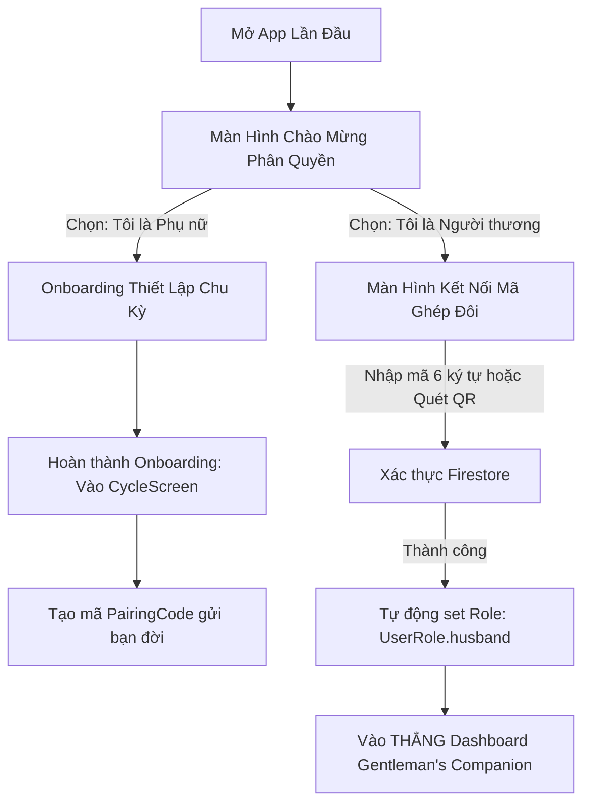

# 🗺️ TÀI LIỆU THIẾT KẾ KIẾN TRÚC & ĐẶC TẢ KỸ THUẬT v0.5.0 (ROADMAP_v0.5.0.md)

> **Dự án:** Moona — Trợ Lý Chu Kỳ Sinh Học & Kết Nối Cặp Đôi  
> **Mục tiêu phiên bản v0.5.0:** Hoàn thiện luồng trải nghiệm Onboarding phân quyền ban đầu, Hệ thống danh xưng linh hoạt 2 chiều, Chồng chủ động hỏi han & Vợ phản hồi 1 chạm, và Đăng nhập Google đồng bộ Avatar đôi.  
> **Thời điểm lập:** 03/09/2026  
> **Kiến trúc áp dụng:** Clean Architecture (Feature-First) + Riverpod 2.x + Cloud Firestore + Hive Local Cache.

---

## 📑 MỤC LỤC
1. [Hệ Thống Danh Xưng Linh Hoạt (Custom Nicknames & Addressing Engine)](#1-hệ-thống-danh-xưng-linh-hoạt-custom-nicknames--addressing-engine)
2. [Luồng Onboarding Phân Quyền Ban Đầu (First-Launch Role Onboarding)](#2-luồng-onboarding-phân-quyền-ban-đầu-first-launch-role-onboarding)
3. [Tính Năng "Chồng Chủ Động Hỏi Han & Vợ Phản Hồi Nhanh" (Husband Proactive Care)](#3-tính-năng-chồng-chủ-động-hỏi-han--vợ-phản-hồi-nhanh-husband-proactive-care)
4. [Đăng Nhập Google & Đồng Bộ Avatar Cặp Đôi (Google Sign-In & Profile Sync)](#4-đăng-nhập-google--đồng-bộ-avatar-cặp-đôi-google-sign-in--profile-sync)
5. [Lộ Trình Triển Khai (Sprint Breakdown)](#5-lộ-trình-triển-khai-sprint-breakdown)

---

## 1. HỆ THỐNG DANH XƯNG LINH HOẠT (CUSTOM NICKNAMES & ADDRESSING ENGINE)

### 1.1. Bối cảnh & Mục tiêu nghiệp vụ
Hiện tại giao diện ứng dụng dùng danh xưng cố định: *"Vợ" / "Chồng"* hoặc *"Nàng" / "Chàng"*. Trong thực tế, các cặp đôi có cách xưng hô rất đa dạng và thân mật (ví dụ: *Bé iu, Em bé, Vợ yêu, Người thương, Anh yêu, Chồng iu...*).  
Hệ thống Danh xưng linh hoạt v0.5.0 cho phép mỗi người dùng tùy biến cách xưng hô cho bản thân và đối phương, đồng thời tự động nội suy văn phong hiển thị trên toàn bộ UI và thông điệp truyền tin.

### 1.2. Danh xưng mặc định & Presets lựa chọn nhanh
- **Giá trị mặc định ban đầu:** `"Người thương"`
- **Bộ Presets lựa chọn nhanh (Chips):**
  * Dành cho đối phương: `["Người thương", "Em bé", "Vợ yêu", "Bé iu", "Nàng thơ", "Chồng yêu", "Anh yêu", "Bạn đời"]`
  * Tự xưng: `["Tôi", "Anh", "Em", "Chồng", "Vợ", "Mình"]`
- **Tự nhập tùy biến:** Cho phép người dùng nhập tự do chuỗi ký tự (tối đa 20 ký tự, có hỗ trợ emoji).

### 1.3. Cơ chế cấu hình 2 chiều (Two-Way Addressing Model)
Mỗi thiết bị lưu cấu hình xưng hô trong `settingsBox` và đồng bộ lên document `couples/{coupleId}`:

```dart
// lib/features/partner_sync/domain/models/nickname_config.dart
class NicknameConfig {
  final String myCallToPartner; // Tôi gọi đối phương là gì (VD: "Bé iu")
  final String mySelfName;       // Tôi tự xưng là gì (VD: "Anh")

  const NicknameConfig({
    this.myCallToPartner = 'Người thương',
    this.mySelfName = 'Tôi',
  });

  Map<String, dynamic> toMap() => {
    'myCallToPartner': myCallToPartner,
    'mySelfName': mySelfName,
  };

  factory NicknameConfig.fromMap(Map<String, dynamic> map) => NicknameConfig(
    myCallToPartner: map['myCallToPartner'] as String? ?? 'Người thương',
    mySelfName: map['mySelfName'] as String? ?? 'Tôi',
  );
}
```

### 1.4. Quy tắc nội suy văn phong thông điệp (Addressing Syntax Engine)
Khi truyền tin nhắn / tín hiệu qua Firestore:
- **Tải trọng tin nhắn lưu cấu trúc:**
  ```json
  {
    "senderRole": "husband",
    "senderNickname": "Anh",
    "recipientNickname": "Bé iu",
    "content": "Ngoan đợi anh về nhé"
  }
  ```
- **Máy nhận (Máy Vợ) hiển thị:**
  * Tiêu đề: `"💖 Lời nhắn từ [senderNickname] 💕"` ➔ *"💖 Lời nhắn từ Anh 💕"*
  * Cú pháp ngữ cảnh: `"[senderNickname] nhắn cho [tên tôi]: [content]"`
  * Nút phản hồi của Vợ: Tự động ghép danh xưng: *"Gửi cho [myCallToPartner]..."*

---

## 2. LUỒNG ONBOARDING PHÂN QUYỀN BAN ĐẦU (FIRST-LAUNCH ROLE ONBOARDING)

### 2.1. Phân luồng trải nghiệm lần đầu mở ứng dụng
Hệ thống kiểm tra cờ `is_onboarding_completed` và `app_user_role` trong `settingsBox`:
- Nếu là lần đầu mở app: **BẮT BUỘC hiển thị Màn hình Chào Mừng Phân Quyền (Role Selection Screen)** trước khi vào bất kỳ luồng nhập liệu nào.



### 2.2. Chi tiết 2 nhánh phân quyền:

#### Nhánh 1: "🌸 Tôi là Phụ nữ — Theo dõi chu kỳ của chính mình"
1. Đặt `app_user_role = UserRole.wife`.
2. Trải nghiệm luồng Onboarding 3 bước chuẩn:
   - Bước 1: Chọn ngày bắt đầu kỳ kinh gần nhất (`DatePicker`).
   - Bước 2: Chọn độ dài chu kỳ trung bình (`Slider` 21 - 45 ngày).
   - Bước 3: Chọn mục tiêu sử dụng app (Theo dõi sức khỏe, Chuẩn bị mang thai, Tránh thai tự nhiên...).
3. Chuyển vào `MainNavScreen` với đầy đủ 4 tab dành riêng cho Vợ:
   - `Tab 0: Chu kỳ` (kèm Hero Indicator, Lịch 4 pha, nút Tạo mã kết nối).
   - `Tab 1: Cảm xúc & Năng lượng`.
   - `Tab 2: Dinh dưỡng sinh học`.
   - `Tab 3: Cài đặt`.

#### Nhánh 2: "🛡️ Tôi là Người thương — Đồng hành & Chăm sóc người ấy"
1. Đặt tạm `app_user_role = UserRole.husband`.
2. Bỏ qua 100% các câu hỏi về kỳ kinh nguyệt, chu kỳ sinh học.
3. Chuyển thẳng đến màn hình **"Kết Nối Cặp Đôi (Dành cho Chồng)"**:
   - Ô nhập 6 ký tự mã ghép đôi (viết hoa tự động).
   - Nút Quét mã QR từ màn hình của nàng.
   - Nút "Trải nghiệm bản mẫu (Demo)" nếu chưa có mã ngay.
4. Khi kết nối thành công:
   - Tự động kéo dữ liệu Firestore mới nhất của nàng (`couples/{coupleId}/status/today`).
   - Mở thẳng **`HusbandViewScreen` (Gentleman's Companion)**.
   - Ẩn vĩnh viễn Bottom Navigation theo dõi chu kỳ kinh nguyệt cá nhân.

---

## 3. TÍNH NĂNG "CHỒNG CHỦ ĐỘNG HỎI HAN & VỢ PHẢN HỒI NHANH" (HUSBAND PROACTIVE CARE)

### 3.1. Hộp "Chăm sóc nàng hôm nay" trên Dashboard Chồng
Trên `HusbandViewScreen`, bổ sung thêm Component tương tác chủ động:
- **Ngân hàng câu hỏi thông minh thích ứng theo từng Pha Chu Kỳ (Phase-Adaptive Inquiries):**

| Pha Chu Kỳ | Câu hỏi gợi ý sẵn (Smart Chips) |
|---|---|
| **Pha Kinh Nguyệt (Hành kinh)** | • "Bụng còn đau nhiều không em?"<br>• "Hôm nay trong người em thế nào?"<br>• "Anh mua chườm nóng / đồ ấm cho em nhé?" |
| **Pha Nang Trứng (Hồi phục)** | • "Năng lượng hôm nay thế nào rồi em?"<br>• "Tối nay mình đi dạo một chút nhé?"<br>• "Em muốn ăn món gì ngon hôm nay?" |
| **Pha Rụng Trứng (Bừng sáng)** | • "Cuối tuần này mình hẹn hò ở đâu em thích?"<br>• "Hôm nay em tươi tắn và đáng yêu quá!" |
| **Pha Hoàng Thể (Tiền kinh nguyệt - PMS)** | • "Em có thấy mệt hay căng thẳng không?"<br>• "Anh mua trà sữa / đồ ngọt mang qua nhé?"<br>• "Hôm nay để anh nấu cơm / rửa bát cho nhé!" |

- **Ô nhập câu hỏi tùy chỉnh:** Cho phép Chồng gõ tin nhắn ngắn (tối đa 100 ký tự) gửi nhanh.

### 3.2. Cấu trúc dữ liệu Firestore subcollection `care_inquiries`
```json
// pairings/{pairingCode}/care_inquiries/{inquiryId}
// hoặc couples/{coupleId}/care_inquiries/{inquiryId}
{
  "id": "uuid-v4",
  "coupleId": "uuid-v4",
  "senderRole": "husband",
  "questionText": "Bụng còn đau nhiều không em?",
  "sentAt": "2026-09-03T15:30:00.000Z",
  "isResponded": false,
  "wifeReply": null,
  "wifeRepliedAt": null
}
```

### 3.3. Luồng hiển thị & Phản hồi nhanh 1 chạm phía máy Vợ
1. **Lắng nghe Stream:** `CycleScreen` phía Vợ lắng nghe subcollection `care_inquiries`.
2. **Hiển thị In-App Card:** Ngay khi nhận được câu hỏi từ Chồng:
   - Banner màu tím pastel hoặc hồng ấm áp xuất hiện ở đầu màn hình:
     > **💌 [Danh xưng Chồng] đang hỏi thăm bạn 💕**  
     > *"[Nội dung câu hỏi của Chồng]"*
3. **Bộ 4 nút phản hồi nhanh 1 chạm (Quick Reply Chips):**
   - 🥺 *"Hơi mệt và mỏi lưng anh ơi"*
   - 🧋 *"Em thèm chút đồ ngọt / trà sữa"*
   - 🥰 *"Em khỏe re, đang nhớ anh nè"*
   - 🛌 *"Em đang nằm nghỉ một chút"*
   - *(Hoặc gõ trả lời nhanh)*
4. **Đồng bộ ngược lại:** Vợ chạm một nút phản hồi -> Cập nhật Firestore -> Màn hình Chồng hiển thị phản hồi của Vợ kèm thời gian tức thì.

---

## 4. ĐĂNG NHẬP GOOGLE & ĐỒNG BỘ AVATAR CẶP ĐÔI (GOOGLE SIGN-IN & PROFILE SYNC)

### 4.1. Mục tiêu kỹ thuật
- Tích hợp xác thực Firebase Authentication qua Google Sign-In (`google_sign_in: ^6.2.1` & `firebase_auth: ^5.1.2`).
- Lưu giữ định danh đám mây vĩnh viễn cho tài khoản người dùng, thay thế việc lưu trữ hoàn toàn ẩn danh.
- Tự động lấy **Photo URL (Avatar)**, **Display Name**, **Email**.

### 4.2. Lưu trữ Profile trong Cloud Firestore
- Collection: `users/{uid}`
  ```json
  {
    "uid": "google-uid-123",
    "email": "user@gmail.com",
    "displayName": "Lan Anh",
    "customNickname": "Em bé",
    "photoUrl": "https://lh3.googleusercontent.com/...",
    "role": "wife",
    "coupleId": "couple-uuid-456",
    "updatedAt": "2026-09-03T15:30:00.000Z"
  }
  ```
- Document Cặp đôi: `couples/{coupleId}`
  ```json
  {
    "coupleId": "couple-uuid-456",
    "wife": {
      "uid": "google-uid-123",
      "displayName": "Lan Anh",
      "photoUrl": "https://...",
      "nickname": "Bé iu"
    },
    "husband": {
      "uid": "google-uid-789",
      "displayName": "Minh Tuấn",
      "photoUrl": "https://...",
      "nickname": "Anh yêu"
    },
    "createdAt": "2026-09-03T15:30:00.000Z"
  }
  ```

### 4.3. Hiển thị Avatar đôi trên Giao diện (Avatar Sync UI)
- **Trên máy Vợ (`CycleScreen`):**
  * Góc AppBar hiển thị Avatar đôi nhỏ lồng vào nhau (Avatar Vợ lồng góc Avatar Chồng với viền trái tim).
- **Trên máy Chồng (`HusbandViewScreen`):**
  * Trên Hero Card hiển thị ảnh đại diện thật của nàng từ Google kèm tên thân mật.
- **Trong Cài Đặt (`SettingsScreen`):**
  * Thẻ Profile hiển thị Avatar Google, nút Đăng nhập / Đăng xuất, và ô đổi Nickname độc lập.

### 4.4. Hướng dẫn kỹ thuật cấu hình Firebase Console (Google Sign-In SHA Fingerprints)
Để Google Sign-In hoạt động trơn tru trên Android mà không bị lỗi `ApiException: 10`:
1. Chạy lệnh lấy mã vân tay SHA của máy phát triển:
   ```powershell
   ./gradlew signingReport
   ```
2. Lấy 2 chuỗi:
   * **SHA-1**: Ví dụ `5E:8F:16:...`
   * **SHA-256**: Ví dụ `FA:C6:17:...`
3. Truy cập **Firebase Console** -> **Project Settings** -> Thẻ **General** -> Mục **Your apps (Android)**:
   * Bấm **Add fingerprint** và dán cả 2 mã SHA-1 và SHA-256.
4. Tải lại tệp `google-services.json` mới nhất và đặt vào thư mục `android/app/`.

---

## 5. LỘ TRÌNH TRIỂN KHAI (SPRINT BREAKDOWN)

```
Moona v0.5.0 Release Plan
├── SPRINT 2A: Onboarding Phân Quyền & Hệ Thống Danh Xưng Tùy Biến
│   ├── [2A.1] Model & Provider: NicknameConfig + AddressingEngine
│   ├── [2A.2] UI Cài đặt: Cho phép chọn Preset và tự nhập danh xưng 2 chiều
│   ├── [2A.3] First-Launch Screen: Màn hình chọn vai trò [Phụ nữ / Người thương]
│   └── [2A.4] Điều hướng Onboarding riêng biệt cho từng vai trò
│
├── SPRINT 2B: Chồng Chủ Động Hỏi Han & Vợ Phản Hồi 1 Chạm
│   ├── [2B.1] Model CareInquiryModel & Subcollection Firestore
│   ├── [2B.2] HusbandView: Hộp "Chăm sóc nàng hôm nay" với câu hỏi thông minh 4 pha
│   ├── [2B.3] CycleScreen (Vợ): In-app Banner câu hỏi thăm kèm 4 nút phản hồi nhanh
│   └── [2B.4] Nghiệm thu đồng bộ 2 chiều trên thiết bị thật và giả lập
│
└── SPRINT 3: Google Sign-In & Đồng Bộ Avatar Cặp Đôi
    ├── [3.1] Cấu hình google_sign_in & firebase_auth
    ├── [3.2] AuthRepository: Luồng Sign-in with Google + Firestore Profile Sync
    ├── [3.3] Đồng bộ Avatar đôi lên AppBar Vợ & Hero Card Chồng
    └── [3.4] Kiểm thử bảo mật & Đóng gói Release v0.5.0
```

---

## 6. TIÊU CHÍ NGHIỆM THU (ACCEPTANCE CRITERIA)
- [ ] Cài đặt mới app: Xuất hiện màn hình chọn vai trò [Tôi là Phụ nữ] / [Tôi là Người thương].
- [ ] Chọn Người thương: Vào thẳng nhập mã, kết nối xong vào ngay Gentleman's Companion.
- [ ] Cấu hình danh xưng: Chọn "Bé iu" / "Anh yêu" -> Toàn bộ banner và câu chào chuyển đúng ngữ pháp.
- [ ] Chồng gửi câu hỏi thăm: Vợ nhận banner kèm 4 nút bấm phản hồi một chạm.
- [ ] Toàn bộ unit tests đạt 100% pass, `flutter analyze` 0 issues.
